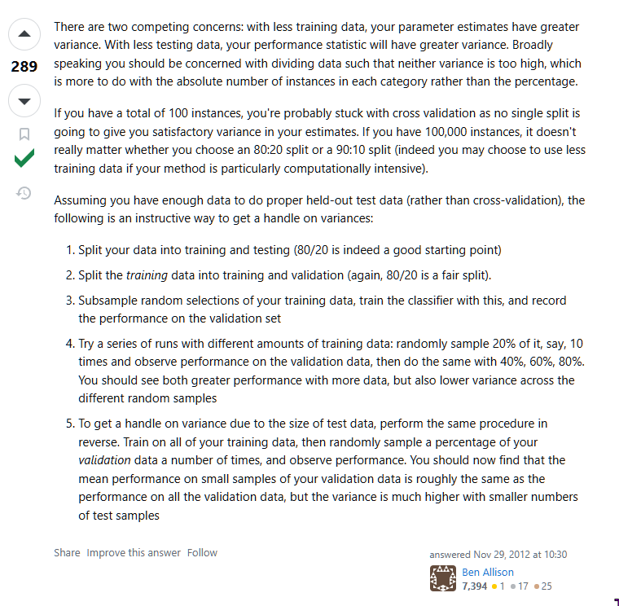
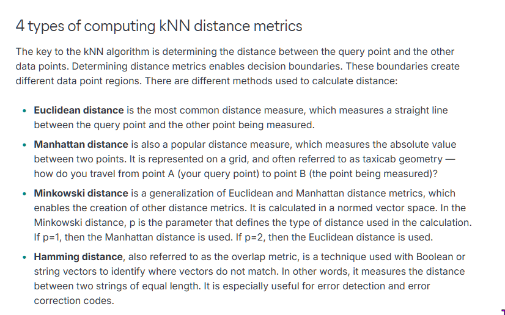

# Problem 1: Train/Test Split
1. Classify images into object catergeories
   1. Each image consist of a single object with one category
   2. 20 categories
   3. 5k images per category
   4. In reallife all catogies are likly to appear

Randomly split the data into train/validation/test

Rule of thumb is 80/20 for training and test then 80/20 fir traububg abd vakudatuib

1. Take 10%==500 images for evalauating the model set aside for test
2. Take 10%==500 for validation
3. Take 80% for training the model 

https://stackoverflow.com/questions/13610074/is-there-a-rule-of-thumb-for-how-to-divide-a-dataset-into-training-and-validatio

Kilian points out that five categories have higher error rate gives 10k images for each of these
- These may be 'similar' images
We have an influx of 10k images for these five categories
What could go wrong if we just add it then retrain it?
  - Overpresentation of 5 caterogies and underpresentation of 15 categories leads to a imbalanced data set
  -  ratio 15000:5000 == 3:1
  -  Minority % : 5000/150000 * 100 = 3% 
  - 15k images for 5 categories it will be come better at identifiying these 5 but worse at identifying the other 15 i.e., overtunning for these five categories

Imbalanced datasets
https://developers.google.com/machine-learning/crash-course/overfitting/imbalanced-datasets#

Solution:
- Downscaling i.e., cutting majority class
- Upweighting i.e., add extra weight to downsampled class

# Problem 2: K-nearest Neighbors
1. Consider that we have a some points and +1 and -1 class. Draw the decision boundary for a 1-NN classifier 
Classification by majority vote of its neighbours (this is supervised data) (5,1) will have the closest neighbour that is (3,1) distance of 4 
- Decision boundary is the point where the distance from group1 and group2 are equal
- For all [0,5] x [0,5] calcualte the the distance from group 1 and group 2 if they are equal then they are on the boundary 

Diffrent metrics for the distance

2. The weight of the second point is reduced by a factor of 100 her 1-NN will effectively be using only a single feature to classify the new data instead of two
The prediction of (500, 1) will be set to class +1 this is becasue the difference of 3 on the second position has a much less signifcant effect than the difference of 200 in the first pisition

3. 