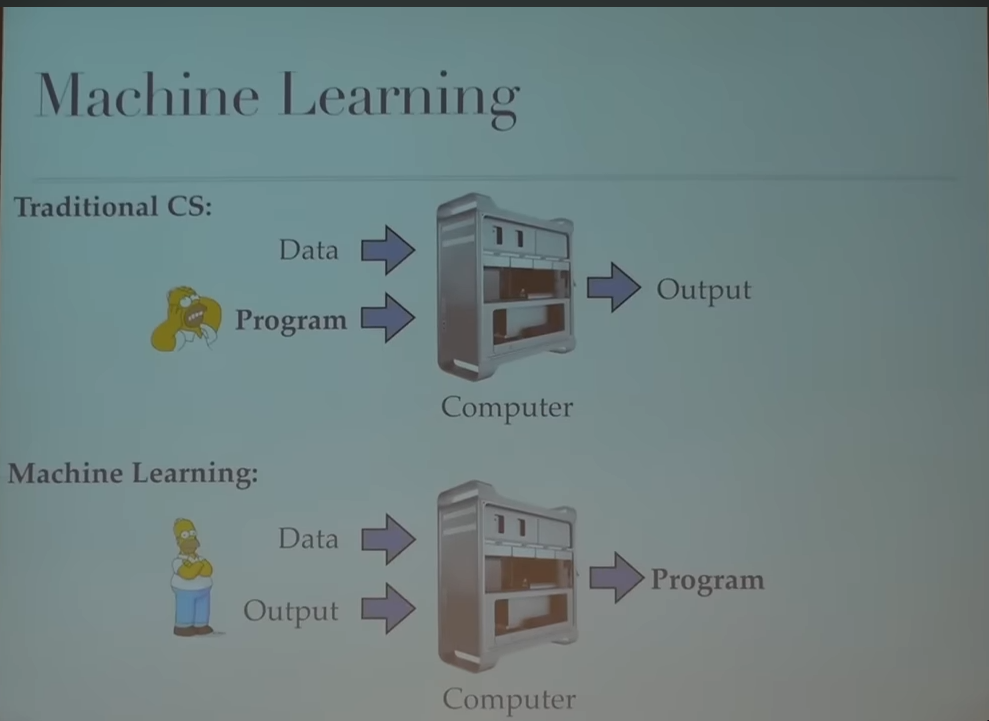
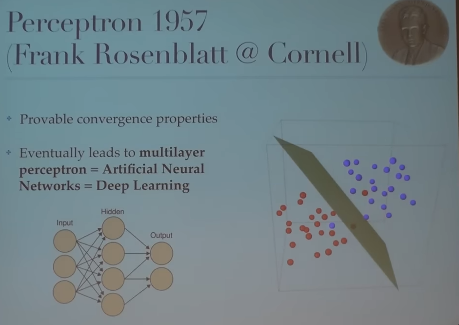
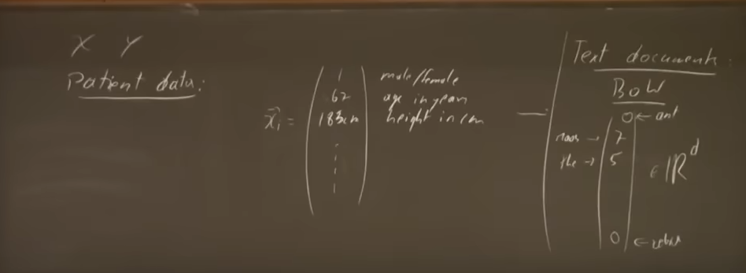

# Machine Learning

Writing programs that we don't even know how to write such as learning some some task that can improve

Formally, machine learning is being able to do some task T, with an output O, but we have some kind of feedback

The algorithm of machine learning by FrankRosenblatt had the algorithm solved however the computer power was lacking 

When this came out and beat the checkers - there was huge fevour over AI however.. it faded down because it was too early!! 

AI Winter by 1969 Minky and Papert 

Computer Science: Was logical beings 
AI: Based on statistics, optimising and logic

Supervised learning:

Require Data that are labeled (vector of features and label) they are iid (indipendant variable)

X: d dimensional vector space which will be rquired to transform the data

## Examples of Y space
e.g., 
Binary Class
- Email spam filtering (yes or no)
- Facial detection is man or female 

Multi-class CL
- What breed of doge is this
- Type of article category 

Regression:
- Y is the real numbers

Vectorial representation of email by just counting the words in a d size of all words 
