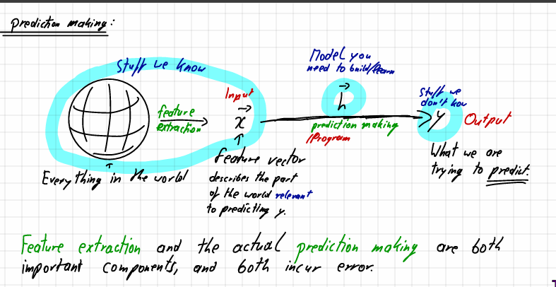
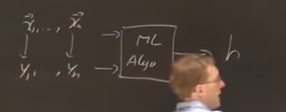
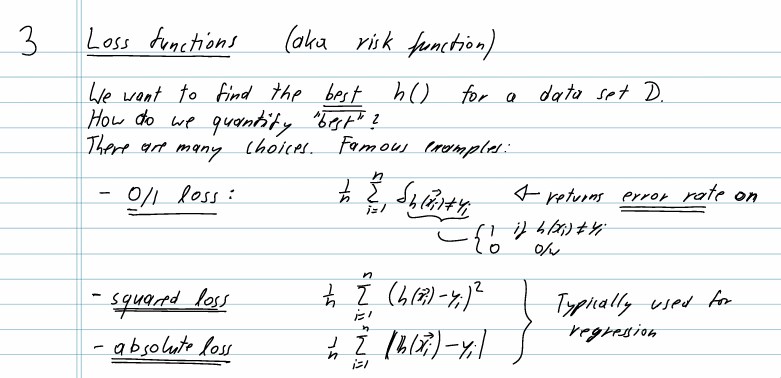
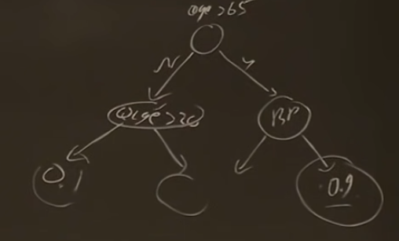
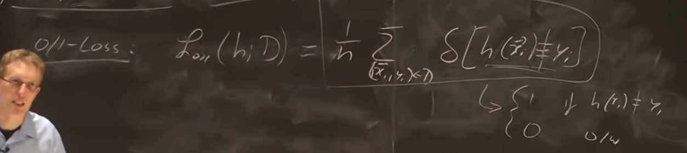
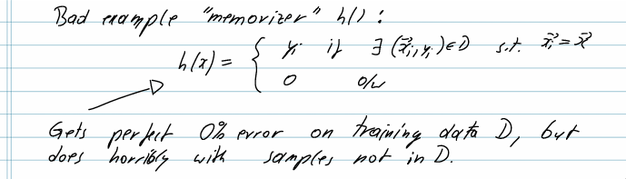

# Supervised Learning Setup Continued

There was an advertisement about data science closely related to machine learning

https://www.cs.cornell.edu/courses/cs4780/2018fa/lectures/lecturenote01_MLsetup.html

P is a ditrubution of mother nature. Otherwise we can jsut do P(y|x) and find the probability - example face recognition

### Feature extraction 

Vectors can be sparse or dense (sparse is good since we can skip the zeroes and fit into memory)

### Training
h is out predication function that maps h(x) -> y

### Testing with - Loss function 
- Take the actual - prediction 

#### Meta machinelearning/ai
This is when the program ml can give suggestion on features - then use the output of that to create the model and generate a new feature/training/loss function

Prompt: Create a model from this data which can predict X

Maybe in the future it will be about creative or outside the box thinking

### Algorithms
Algorithm =! classfiers
Types of classifiers i.e., the h in the hypothesis class
- Decision trees
- 

- Regression 
- Linear classifiers (Perception)
- Artificial Neural Network (aka Deep learning)
- Support vector machines

There is a principled way to decide which algorithm (h) is the best
- We should teach the AI to try this and reason which one is the best classifier // potential practical for this class Project 2

The Loss function evaluates how well the h works on the dataset 

Loss lower is better this one gives proportion of errors (or error percentage if * 100)

- Squared loss: good for house prediction or things that can be -ve or +ve
- Absolute loss: doesnt punish it as much when the nubers are really small [h(x) - y  < 1] I guess the squared will give an incorrect value Otherwise the numbers are way to large
- The problem is that we might optimize for the larger differences - large difference skews data alot

The memorizer problem - if the problem is not on the exam haha gg (memorizers)
The loss is actually 0 for any of the thing

e.g., Millitary images measured the brightness of the image - we need to extract the features

### No free lunch theorem
- There is no h in hypothesis class for all 