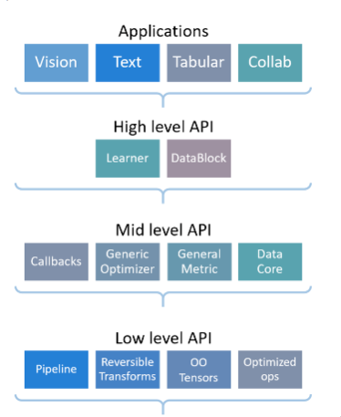

# Fastai
- Deep learning library which allows practiioners to iterate quickly and test quickly
- 
High level built on low level apis

Note on windows suppoert:
- Python has multiprocessing issues on Jupyter + Windows `num_workers` is set to 0. This doesn't happen if you run it from a python script through.
